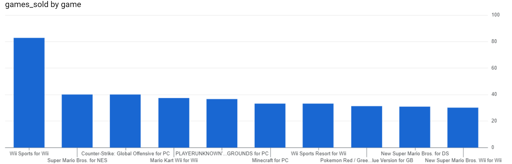
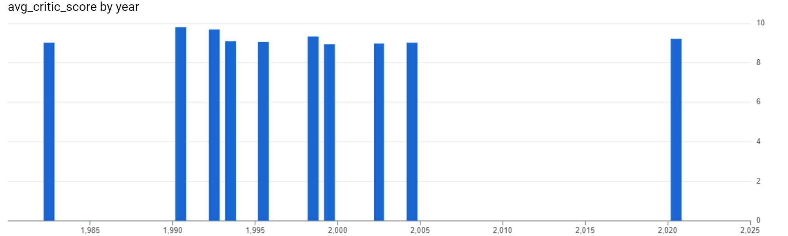
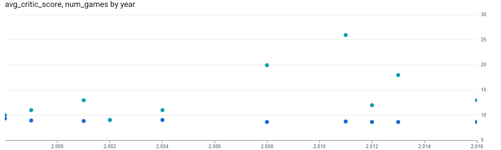
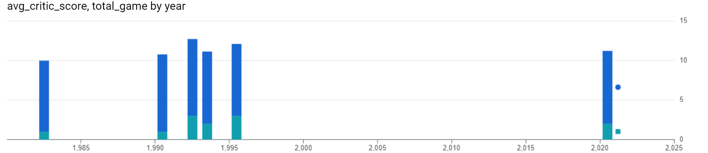

# Data Analysis Using Bigquery

 A Data Analysis Exploration using Bigquery

## Golden Age Of Video Games

 🎮 Video Games: A Booming Industry 💰

The global gaming market is exploding! It's projected to be worth over $300 billion by 2027 (according to [Mordor Intelligence](https://www.mordorintelligence.com/industry-reports/global-gaming-market)). With stakes this high, game publishers are in a race to create the next blockbuster hit. But the question remains: are games actually getting better, or have we already seen the golden age of gaming?

Let's dive in! We'll analyze the top 400 best-selling video games from 1977 to 2020. By comparing sales data with critic and user reviews, we'll uncover whether video games are truly improving as the industry grows. 💥

Our database holds two key tables (we've used a sample of 400 rows for this project).  You can find the full dataset with over 13,000 games on [Kaggle](https://www.kaggle.com/holmjason2/videogamedata).

### Dataset Description

#### game_sales


#### reviews


### Task 1: The Ten Best-Selling Video Games

Let's begin by looking at some of the top selling video games of all time!
The SQL code used for top ten Best-Selling Video Games [Task 1 code](GoldenAgeOfVideoGames/src/Task1.sql).

```SQL
select * from VideoGamesSalesData.game_sales
order by games_sold desc
limit 10;
```

Result [Task 1 data](GoldenAgeOfVideoGames/csv_data/Task1.csv).

|game                                     |platform|publisher       |developer        |games_sold|year|
|-----------------------------------------|--------|----------------|-----------------|----------|----|
|Wii Sports for Wii                       |Wii     |Nintendo        |Nintendo EAD     |82.9      |2006|
|Super Mario Bros. for NES                |NES     |Nintendo        |Nintendo EAD     |40.24     |1985|
|Counter-Strike: Global Offensive for PC  |PC      |Valve           |Valve Corporation|40.0      |2012|
|Mario Kart Wii for Wii                   |Wii     |Nintendo        |Nintendo EAD     |37.32     |2008|
|PLAYERUNKNOWN'S BATTLEGROUNDS for PC     |PC      |PUBG Corporation|PUBG Corporation |36.6      |2017|
|Minecraft for PC                         |PC      |Mojang          |Mojang AB        |33.15     |2010|
|Wii Sports Resort for Wii                |Wii     |Nintendo        |Nintendo EAD     |33.13     |2009|
|Pokemon Red / Green / Blue Version for GB|GB      |Nintendo        |Game Freak       |31.38     |1998|
|New Super Mario Bros. for DS             |DS      |Nintendo        |Nintendo EAD     |30.8      |2006|
|New Super Mario Bros. Wii for Wii        |Wii     |Nintendo        |Nintendo EAD     |30.3      |2009|

Visualization [Task 1 visualization](GoldenAgeOfVideoGames/images/visualizations/Task1.png).




### Task 2: Missing Review Scores

Wow, the best-selling video games were released between 1985 to 2017! That's quite a range; we'll have to use data from the reviews table to gain more insight on the best years for video games.

First, it's important to explore the limitations of our database. One big shortcoming is that there is not any reviews data for some of the games on the game_sales table.

The SQL code used for missing reviews [Task 2 code](GoldenAgeOfVideoGames/src/Task1.sql).

```SQL
SELECT COUNT(g.game)as MissingReviews
FROM VideoGamesSalesData.game_sales g
left JOIN VideoGamesSalesData.reviews r
ON g.game = r.game
WHERE critic_score IS NULL AND user_score IS NULL;
```

Result

|MissingReviews                           |
|-----------------------------------------|
|31                                       |

### Task 3:  Years that Video Game Critics Loved

🔍 Missing Reviews: Nothing to Worry About (for now!)

It looks like a tiny bit under ten percent of the games in our game_sales table are missing review data.  That's small enough to keep exploring, but let's file it away in our minds as we analyze those fancy query results later!

🌟 Critics' Choice: Finding the Golden Years of Gaming 🌟

There are tons of ways to figure out the best years in video game history!  Let's dive into what the critics have to say first.

The SQL code used for Top ten games according to critics choice [Task 3 code](GoldenAgeOfVideoGames\src\Task3.sql).

```SQL
select year,round(avg(critic_score),2)as avg_critic_score from VideoGamesSalesData.reviews as r
inner join VideoGamesSalesData.game_sales as g
on g.game=r.game
group by year
order by avg_critic_score desc
limit 10
```

Result [Task 3 data](GoldenAgeOfVideoGames/csv_data/Task3.csv).

|year                                     |avg_critic_score|
|-----------------------------------------|----------------|
|1990                                     |9.8             |
|1992                                     |9.67            |
|1998                                     |9.32            |
|2020                                     |9.2             |
|1993                                     |9.1             |
|1995                                     |9.07            |
|2004                                     |9.03            |
|1982                                     |9.0             |
|2002                                     |8.99            |
|1999                                     |8.93            |


Visualization [Task 3 visualization](GoldenAgeOfVideoGames/images/visualizations/Task3.png).



### Task 4: Was 1982 Really That Great?

🕵️‍♀️ Case of the Curious Critic Scores 🕵️‍♀️

Okay, our critic reviews suggest the golden age of video games stretches from 1982 all the way to 2020.  That's a HUGE range!

Hold on a second... those avg_critic_score values seem a little too perfect.  1982's score looks especially suspicious. Could it be that our dataset is missing some key releases from certain years?

Time to dig deeper! Let's refine our query and see if 1982 really deserves its top-ranking status.

The SQL code used for Top ten games  according to critics choice [Task 4 code](GoldenAgeOfVideoGames\src\Task4.sql).

```SQL
select year,count(g.game) as num_games,round(avg(critic_score),2)as avg_critic_score from VideoGamesSalesData.reviews as r
inner join VideoGamesSalesData.game_sales as g
on g.game=r.game
group by year
having count(g.game)>4
order by avg_critic_score desc
limit 10
```

Result [Task 4 data](GoldenAgeOfVideoGames/csv_data/Task4.csv).

|year                                     |num_games|avg_critic_score|
|-----------------------------------------|---------|----------------|
|1998                                     |10       |9.32            |
|2004                                     |11       |9.03            |
|2002                                     |9        |8.99            |
|1999                                     |11       |8.93            |
|2001                                     |13       |8.82            |
|2011                                     |26       |8.76            |
|2016                                     |13       |8.67            |
|2013                                     |18       |8.66            |
|2008                                     |20       |8.63            |
|2012                                     |12       |8.62            |

Visualization [Task 4 visualization](GoldenAgeOfVideoGames/images/visualizations/Task4.png).



### Task 5: Years that Dropped Off the Critics' Favorites List 

🌟 The Hunt for Hidden Gems 🌟

Alright, that num_games column looks much more convincing! Now we're confident our top critic years list truly showcases periods with multiple fantastic releases, not just random hits.

But wait! Which years narrowly missed the cut due to a lack of reviews?  Let's uncover those hidden gems.  Someday, we might just find enough reviews to prove they deserved a spot on the list! 🕵️‍♀️

Get those Set Theory Brains Ready  🧠

We've got the results of our past queries neatly stored in tables. Time to put those set theory skills to work!


<h3 id="top_critic_years"><code>top_critic_years</code></h3>
<table>
<thead>
<tr>
<th style="text-align:left;">column</th>
<th>type</th>
<th>meaning</th>
</tr>
</thead>
<tbody>
<tr>
<td style="text-align:left;"><code>year</code></td>
<td>int</td>
<td>Year of video game release</td>
</tr>
<tr>
<td style="text-align:left;"><code>avg_critic_score</code></td>
<td>float</td>
<td>Average of all critic scores for games released in that year</td>
</tr>
</tbody>
</table>
<h3 id="top_critic_years_more_than_four_games"><code>top_critic_years_more_than_four_games</code></h3>
<table>
<thead>
<tr>
<th style="text-align:left;">column</th>
<th>type</th>
<th>meaning</th>
</tr>
</thead>
<tbody>
<tr>
<td style="text-align:left;"><code>year</code></td>
<td>int</td>
<td>Year of video game release</td>
</tr>
<tr>
<td style="text-align:left;"><code>num_games</code></td>
<td>int</td>
<td>Count of the number of video games released in that year</td>
</tr>
<tr>
<td style="text-align:left;"><code>avg_critic_score</code></td>
<td>float</td>
<td>Average of all critic scores for games released in that year</td>
</tr>
</tbody>
</table>

Years that dropped off the critics' favorites list [Task 5 code](GoldenAgeOfVideoGames\src\Task5.sql).

```SQL
with tmp as (
select year,round(avg(critic_score),2)as avg_critic_score,count(g.game) as total_game from VideoGamesSalesData.reviews as r
inner join VideoGamesSalesData.game_sales as g
on g.game=r.game
group by year
order by avg_critic_score desc
limit 10
)
select * from tmp

EXCEPT Distinct

select year,round(avg(critic_score),2)as avg_critic_score,count(g.game) as total_game from VideoGamesSalesData.reviews as r
inner join VideoGamesSalesData.game_sales as g
on g.game=r.game
group by year
having count(g.game)>4
```

Result [Task 5 data](GoldenAgeOfVideoGames/csv_data/Task5.csv).

|year|avg_critic_score|total_game|
|----|----------------|----------|
|1990|9.8             |1         |
|1992|9.67            |3         |
|2020|9.2             |2         |
|1993|9.1             |2         |
|1995|9.07            |3         |
|1982|9.0             |1         |

Visualization [Task 5 visualization](GoldenAgeOfVideoGames/images/visualizations/Task5.png).



### Task 6: Years Video Game Players Loved

🌟 What the Players Say: Did the '90s Really Rule? 🌟

Our critics seem to think the early 1990s might have been a golden age...  But for true insight, we need the scoop from the experts: the players themselves!

Let's dive into the user_score data.  Could a different era emerge as the champion?  Time to fire up a new query and find out!

user_score favorites list [Task 6 code](GoldenAgeOfVideoGames\src\Task6.sql).

```SQL
select year, round(avg(user_score),2) as avg_user_score,count(g.game) as num_games from VideoGamesSalesData.game_sales as g
inner join VideoGamesSalesData.reviews as r
on g.game=r.game
group by year
having count(g.game)>4
order by avg_user_score desc
limit 10
```

Result [Task 6 data](GoldenAgeOfVideoGames/csv_data/Task6.csv).

|year|avg_user_score|num_games|
|----|--------------|---------|
|1997|9.5           |8        |
|1998|9.4           |10       |
|2010|9.24          |23       |
|2009|9.18          |20       |
|2008|9.03          |20       |
|1996|9.0           |5        |
|2005|8.95          |13       |
|2006|8.95          |16       |
|1999|8.8           |11       |
|2000|8.8           |8        |


### Task 7:  Years that Both Players and Critics Loved

🕵️‍♀️ The Quest for Legendary Years 🕵️‍♀️

We've analyzed critic scores and player opinions – the results are in!  Now, the exciting question: did any years earn high praise from both critics and gamers?  Those could be the true legends of the video game world!

Let's cross-reference our findings.  Recall that the top_critic_years_more_than_four_games table holds the champions according to the critics...

<table>
<thead>
<tr>
<th style="text-align:left;">column</th>
<th>type</th>
<th>meaning</th>
</tr>
</thead>
<tbody>
<tr>
<td style="text-align:left;"><code>year</code></td>
<td>int</td>
<td>Year of video game release</td>
</tr>
<tr>
<td style="text-align:left;"><code>num_games</code></td>
<td>int</td>
<td>Count of the number of video games released in that year</td>
</tr>
<tr>
<td style="text-align:left;"><code>avg_critic_score</code></td>
<td>float</td>
<td>Average of all critic scores for games released in that year</td>
</tr>
</tbody>
</table>
<p>We've also saved the results of our top user years query from the previous task into a table:</p>
<h3 id="top_user_years_more_than_four_games"><code>top_user_years_more_than_four_games</code></h3>
<table>
<thead>
<tr>
<th style="text-align:left;">column</th>
<th>type</th>
<th>meaning</th>
</tr>
</thead>
<tbody>
<tr>
<td style="text-align:left;"><code>year</code></td>
<td>int</td>
<td>Year of video game release</td>
</tr>
<tr>
<td style="text-align:left;"><code>num_games</code></td>
<td>int</td>
<td>Count of the number of video games released in that year</td>
</tr>
<tr>
<td style="text-align:left;"><code>avg_user_score</code></td>
<td>float</td>
<td>Average of all user scores for games released in that year</td>
</tr>
</tbody>
</table>

user_score and critics favorites list [Task 7 code](GoldenAgeOfVideoGames\src\Task7.sql).

```SQL
with critic as(
select year,count(g.game) as num_games,round(avg(critic_score),2)as avg_critic_score from VideoGamesSalesData.reviews as r
inner join VideoGamesSalesData.game_sales as g
on g.game=r.game
group by year
having count(g.game)>4
order by avg_critic_score desc
limit 10),
user_score as
(select year,count(ga.game) as num_games, round(avg(user_score),2) as avg_user_score from VideoGamesSalesData.game_sales as ga
inner join VideoGamesSalesData.reviews as rv
on ga.game=rv.game
group by year
having count(ga.game)>4
order by avg_user_score desc
limit 10
)
select year from critic

intersect Distinct
select year from user_score
order by year 
```

Result [Task 7 data](GoldenAgeOfVideoGames/csv_data/Task7.csv).

|year|
|----|
|1998|
|1999|

### Task 8: Sales in the Best Video Game Years

🤑 Did the Cash Registers Ring? 🤑

We've uncovered two years that ignited the passion of both players and critics.  But in the game industry, passion isn't the only metric that matters.  Did those years also translate into blockbuster sales?

Time to investigate!  We'll whip up a clever query without relying on a pre-saved table.   Get those subquery skills ready –  this is how the pros do it when direct database modification isn't possible!

Total sales in peek years [Task 8 code](GoldenAgeOfVideoGames\src\Task8.sql).

```SQL
select year,sum(games_sold)as total_games_sold from VideoGamesSalesData.game_sales
where year in (
with critic as(
select year,count(g.game) as num_games,round(avg(critic_score),2)as avg_critic_score from VideoGamesSalesData.reviews as r
inner join VideoGamesSalesData.game_sales as g
on g.game=r.game
group by year
having count(g.game)>4
order by avg_critic_score desc
limit 10),
user_score as
(select year,count(g.game) as num_games, round(avg(user_score),2) as avg_user_score from VideoGamesSalesData.game_sales as g
inner join VideoGamesSalesData.reviews as r
on g.game=r.game
group by year
having count(year)>4
order by avg_user_score desc
limit 10
)
select year from critic
intersect Distinct
select year from user_score
order by year 
)
group by year
order by 2 desc
```

Result [Task 8 data](GoldenAgeOfVideoGames/csv_data/Task8.csv).

|year|total_games_sold  |
|----|------------------|
|1998|101.51999999999998|
|1999|74.9              |


### Task 9: Best games in each year

🏆 Leaderboard Legends: Unveiling the Top-Selling Games 🏆

Get ready to analyze the sales data and discover which games dominated the market each year! Let's see who crushed the competition and made it to the top of the sales leaderboards.

Best games in each year [Task 9 code](GoldenAgeOfVideoGames\src\Task9.sql).

```SQL
SELECT game,year,
games_sold,
rank() over(partition by year order by games_sold desc) as rank

 FROM `playground-s-11-8f4cb28f.VideoGamesSalesData.game_sales` 

```

Result [Task 9 data](GoldenAgeOfVideoGames/csv_data/Task9.csv).

