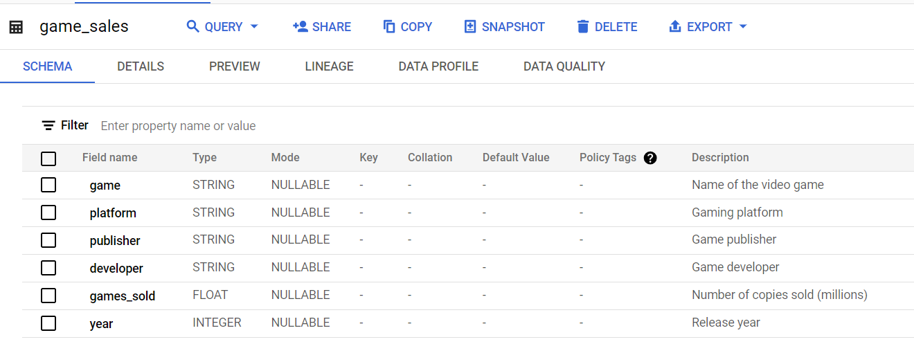
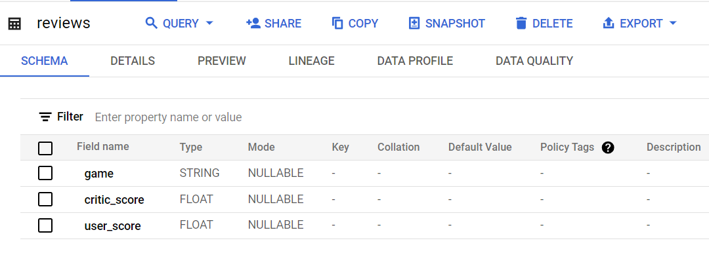

# Data Analysis Using Bigquery

 A Data Analysis Exploration using Bigquery

## Golden Age Of Video Games

 🎮 Video Games: A Booming Industry 💰

The global gaming market is exploding! It's projected to be worth over $300 billion by 2027 (according to [Mordor Intelligence](https://www.mordorintelligence.com/industry-reports/global-gaming-market)). With stakes this high, game publishers are in a race to create the next blockbuster hit. But the question remains: are games actually getting better, or have we already seen the golden age of gaming?

Let's dive in! We'll analyze the top 400 best-selling video games from 1977 to 2020. By comparing sales data with critic and user reviews, we'll uncover whether video games are truly improving as the industry grows. 💥

Our database holds two key tables (we've used a sample of 400 rows for this project).  You can find the full dataset with over 13,000 games on [Kaggle](https://www.kaggle.com/holmjason2/videogamedata).

### Dataset Description

#### game_sales

#### reviews

### Task 1: The Ten Best-Selling Video Games

Let's begin by looking at some of the top selling video games of all time!
The SQL code used for top ten Best-Selling Video Games [Task 1](GoldenAgeOfVideoGames/src/Task1.sql). 

### Task 2: Missing Review Scores

### Task 3:  Years that Video Game Critics Loved

### Task 4: Was 1982 Really That Great?

### Task 5: Years that Dropped Off the Critics' Favorites List 

### Task 6: Years Video Game Players Loved

### Task 7:  Years that Both Players and Critics Loved

### Task 8: Sales in the Best Video Game Years

